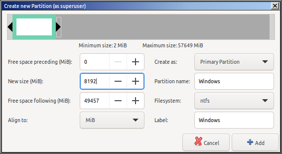

# Windows and Linux multi-boot USB installer setup without using Ventoy

The purpose of this document and method is to show you how you can easily create a **dual- or multi-boot Windows/Linux USB pendrive** so that you can run the Windows 11 installer and one or more Linux installer/live-boot iso's from the same USB stick.

So if you have <a href="https://github.com/ventoy/Ventoy/issues/2795">security concerns</a> about some other multi-boot methods (e.g. Ventoy), or you're just interested in a **quick and easy multi-boot installer setup without using any 3rd-party tools**, then you're in the right place.

**The method explained here is VERIFIABLY CLEAN (so there are no potential security concerns) as it uses no 3rd-party tools or binary blobs**. All executables are coming directly from the official Linux and Windows installer iso's. No 3rd party executables.

If you're an experienced/advanced Linux or Windows user (e.g. a sysadmin or sysdev), then you can just jump right in and start with the [Method overview](#method-overview) section (which is the short version) to see a quick overview of the steps needed to set up the multi-boot usb stick.

## Table of Contents
- [Introduction](#introduction)
- [Method overview](#method-overview)
- [Setup instructions for Linux users](#setup-for-linux-users)
- [Setup instructions for Windows users](#setup-for-windows-users)

## Introduction

The primary purpose of this document and method is to show you how you can easily create a **dual- or multi-boot Windows/Linux USB pendrive** so that you can run the Windows 11 installer and one or more Linux installer/live-boot iso's from the same USB stick.

This method **supports the "1 Windows installer + Multiple Linux installer/live-boot iso's" use case**.

Our focus with this method is to support the current (2025) everyday use cases in the context of Windows 11 and Linux and hence **UEFI and Secure Boot are supported**, while  **legacy MBR boot is NOT supported by this method**.

Also note that **this method only supports 1 Windows installer per USB pendrive** as the Windows 11 installer is run from its own partition and not from its iso directly.

But this "**1 Windows installer + Multiple Linux installer/live-boot iso's**" method is general enough to cover most of the everyday use cases that everyday Linux and Windows users are likely to come across. 

(More advanced users can, of course, extend this method by using e.g. Clonezilla-based partitioning and reimaging methods to cover their more specialised use cases. But these advanced methods are not discussed here. (See Windows Sysprep, Clonezilla and related topics for details.) Nevertheless we're gonna add a Clonezilla live-boot option to our USB pendrive just in case you wanna go down this route and store OS (e.g. Windows) images locally on the pendrive (and restore them by using a local Clonezilla boot instead of a PXE boot) or just use Clonezilla for remote OS cloning as usual.)

There are **several methods of creating single- or multi-boot USB pendrives** that vary in generality and hence in what use cases they cover and support.

To see where the method explained here fits into the bigger picture, let's just quickly summarise the relevant bootable USB creation methods.

<table>
    <thead>
        <tr>
            <th>Windows boot</th>
            <th>Linux boot</th>
            <th>Method</th>
            <th>Limitations</th>
        </tr>
    </thead>
    <tbody>
        <tr>
            <td></td><td style="text-align:center;">1</td><td>e.g. <a href="https://rufus.ie/en/">Rufus</a>, <a href="https://etcher.balena.io/">Etcher</a>, <a href="https://ubuntu.com/tutorials/create-a-usb-stick-on-ubuntu">Startup Disk Creator</a></td><td>Only 1 OS installer per USB stick</td>
        </tr>
        <tr>
            <td style="text-align:center;">1</td><td></td><td>e.g. <a href="https://rufus.ie/en/">Rufus</a>, <a href="https://etcher.balena.io/">Etcher</a>, <a href="https://ubuntu.com/tutorials/create-a-usb-stick-on-ubuntu">Startup Disk Creator</a></td><td>Only 1 OS installer per USB stick</td>
        </tr>        <tr>
            <td></td><td>multi</td><td><a href="https://github.com/thias/glim">GLIM</a></td><td>Only supports Linux. It doesn't support iso's larger than 4 GB</td>
        </tr>
        <tr>
            <td style="text-align:center;">1</td><td>multi</td><td><b>This method</b></td><td><b>Only 1 Windows installer per USB stick</b>. (But it can be extended to support multiple Windows OS images by using e.g. local Clonezilla OS images. But this advanced topic is not discussed here.)</td>
        </tr>
        <tr>
            <td style="text-align:center;">multi</td><td>multi</td><td><a href="https://www.ventoy.net">Ventoy</a></td><td><b>Security concerns</b> because of binary blobs. <a href="https://github.com/ventoy/Ventoy/issues/2795">See this issue</a></td>
        </tr>
    </tbody>
</table>
 
Methods lower in the above table are, of course, functionally more general than previous methods higher in the table and hence they also support the use cases of methods higher in the table.

 

So their order of generality is

Ventoy (multi - multi) > **This method (1 - multi)** > GLIM (0 - multi) > Rufus (1)

So this Windows-Linux multi-boot installer solution sits between Ventoy (multi-multi boot) and Linux-multiboot solutions because on top of supporting Linux-multiboot it also supports booting a Windows installer.

This "**1 Windows installer + Multiple Linux installer/live-boot iso's on a USB stick**" is the general use case that most people are interested in as this is the most revelant use case that people are likely to come across in everyday life (especially Linux users or sysadmins).

And the method explained here provides a solution for this exact use case.

What are the **advantages of this method** over the other methods (including Ventoy)?:

  1. **It doesn't require any special tools** (e.g. Rufus, Etcher, Startup Disk Creator)
  
       Both Linux and Windows have the built-in tools needed to use this method.
       
       Hence both Linux and Windows users can easily create the multi-boot usb stick.
       
       So if you don't have access to iso burning tools like Rufus or Etcher, or you don't wanna use them because you want a multi-boot usb pendrive, then no problem, you can just simply use this method instead to set up the multi-boot usb stick in no time.
    
  2. **Both Linux and Windows users can use this method**. And it's very easy to setup and use
  
  3. There are **NO SECURITY CONCERNS** whatsoever as this method is **COMPLETELY TRANSPARENT and IT DOES NOT USE ANY 3RD-PARTY TOOLS, BINARY BLOBS OR MODIFIED EXECUTABLES**.
  
       **All executables are coming directly from the OFFICIAL LINUX AND WINDOWS INSTALLER ISO'S. No 3rd-party executables.**
  
  4. Hence this method is fully (and easily) auditable from a security point of view. And it's COMPLETELY and **VERIFIABLY CLEAN**.

So you can be sure that it does exactly what it says on the tin without your security being potentially compromised. So if you have security concerns about other multi-boot methods (e.g. Ventoy), then you can use this method instead because it's **verifiably clean** and it covers most of the everyday use cases.

The only conceptual differences between this method and Ventoy are that

  1. This method only supports **1 Windows installer on the USB stick**
  
  2. The Windows installer needs to be set up on a separate partition and it doesn't boot directly from the Windows installer iso

  3. It only supports UEFI and Secure Boot. Legacy MBR boot is not supported. (Because Windows 11 doesn't support legacy MBR boot.)

But other than that it's functionally the same as Ventoy as you can boot multiple linux iso's. Just like in the case of Ventoy.

So **this method uses 1 Windows installer partition + supports multiple Linux installer/live-boot iso's**.

 

## Method overview

In our example setup, we're gonna create a **triple-boot usb pendrive** with 

  1. Ubuntu MATE 24.04
  2. Windows 11
  3. Clonezilla 
  
 as this is a **typical minimalist setup** that is useful for everyday use by a typical Linux user.

(Of course, you can replace the above Linux option with your favourite Linux distro.)

The Ubuntu option is the official live-boot OS installer, which allows you to **try and/or install Ubuntu**.

So if you're a Windows user, you can just simply and safely use this boot option to try Ubuntu on your machine without actually installing it.

The **Windows 11** option is an **OS installer**, so it's gonna **install Windows 11**.

And the Clonezilla option is just a **usual Clonezilla live-boot and not an installer** just so that you (more advanced users) can do usual clonezilla stuff like disk/partition backups, reimaging or cloning.

If you need more Linux distros on the usb stick, you can just chuck them on there as iso's and hook them up to the boot menu very easily. (See below.)

Conceptually the setup of this usb multi-boot is very simple:

1. We have to **partition** the usb pendrive using **GPT** because of the UEFI boot

2. Create **3 GPT partitions** (called **"BOOT" (1 GB, FAT32), "Windows" (8 GB, NTFS), "Linux" (the remaining GB, ext4 or NTFS** depending on whether you're a Linux or Windows user)) for the various components

        Linux users: Format the Linux partition as ext4

        Windows users: Format the Linux partition as NTFS

3. Copy the **Ubuntu bootloader "boot" and "EFI" folders** from the ubuntu iso to the UEFI BOOT partition of the usb stick

        <ubuntu.iso>/boot/ -> <BOOT>/boot/

        <ubuntu.iso>/EFI/ -> <BOOT>/EFI/

4. Copy the **Windows 11 installer files** from the Windows iso to the Windows partition

        <windows.iso>/* -> <Windows>/

5. Copy the Ubuntu and Clonezilla iso's into the **/boot/iso/ folder** on the Linux partition

        <Linux>/boot/iso/ubuntu-mate-24.04.2-desktop-amd64.iso
        
        <Linux>/boot/iso/clonezilla-live-20241010-oracular-amd64.iso

6. Overwrite grub.cfg on the BOOT partition with **grub.cfg from this repo**

        Linux users: <this repo>/grub.cfg -> <BOOT>/boot/grub/grub.cfg

        Windows users: <this repo>/grub.cfg.for_windows_users -> <BOOT>/boot/grub/grub.cfg

7. **Adjust grub.cfg**, if needed, to support the Linux distro(s) that you're trying to boot

   And to match the names of the latest Ubuntu, Windows 11 and Clonezilla iso's that you downloaded.

 

So if you're an experienced/advanced Linux or Windows user (e.g. a sysadmin or a sysdev), then you can just jump right in and use the above steps to set up the multi-boot usb stick.

However, for less experienced users I provided the following 2 sections that go through the setup process in detail in both cases.

To use the above triple-boot setup, **you will need an at least 16 GB USB pendrive**. Of course, if you wanna add more Linux distro iso's to the mix, then you will need more space. (The USB pendrive used for the example setup below just happened to be 64 GB.)

The following **official installer and live-boot iso's** were used for this example setup:

  1. Ubuntu MATE 24.04 (LTS)
    
            ubuntu-mate-24.04.2-desktop-amd64.iso

            SHA256: ec1399cf90678c29ee1f80055826b21a3d90f59d50d154e5ea70b1931ce909c9
            SHA1: 93c7a01541a242fe9fec7dc96086ba3c0aa4f48e
            Size: 4.3 GB (4,301,398,016 bytes)
                    
  2. Windows 11

            Win11_24H2_EnglishInternational_x64.iso

            SHA256: d5a4c97c3e835c43b1b9a31933327c001766ce314608ba912f2fffc876044309
            SHA1: 1df19b01b5a6245640fcceaf6fbcdf3e03bc32b8
            Size: 5.8 GB (5,832,091,648 bytes)

  3. Clonezilla 
  
            clonezilla-live-20241010-oracular-amd64.iso

            SHA256: 783d564489f6b780167cbb11f7026f4a9c32d4c4372ce6254e5b0e4e60cb44dc
            SHA1: 3df5e1914ae50b8f7c3f231ddd7fa1f41b758efa
            Size: 546 MB (545,259,520 bytes)

 

## Setup instructions for Linux users

1. We have to **partition** the usb pendrive using **GPT** because of the UEFI boot

    **Use gparted to delete all the partitions** (if any) from your USB pendrive so that **all disk space becomes unallocated** like this

    
    
    Then **partition** the USB stick using **GPT** partitioning (instead of MBR).

    Device -> **Create Partition Table**

    

    and then select "**gpt**" as the partition type

    

2. Create **3 GPT partitions** (called **"BOOT" (1 GB, FAT32), "Windows" (8 GB, NTFS), "Linux" (the remaining GB, ext4)**) for the various components

    Partition 1: **"BOOT", 1 GB (1024 MB), FAT32**

    Create a new GPT partition: Right click on the unallocated space and select **"New"**

    

    And then specify the following parameters: **"BOOT", 1 GB (1024 MB), FAT32**

    

    Partition 2: **"Windows", 8 GB (8192 MB), NTFS**

    

    (Currently the size of the Windows 11 installer iso (Win11_24H2_EnglishInternational_x64.iso) is about 6 GB. So we allocate 8 GB to this partition just in case future Windows 11 installer versions have increased iso sizes. So if you later wanna upgrade your usb stick to the latest Windows 11 installer version, then you won't have to repartition the pendrive.)

    Partition 3: **"Linux", the remaining GB, ext4**

    

    You have to **click on the green checkmark icon** for your changes to be applied to the pendrive

    

    After partitioning, the USB pendrive should look like this

    
    
3. Copy the **Ubuntu bootloader "boot" and "EFI" folders** from the ubuntu iso to the UEFI BOOT partition of the usb stick

    Download the Ubuntu MATE 24.04.2 installer iso from the Ubuntu website: 
    https://cdimage.ubuntu.com/ubuntu-mate/releases/noble/release/ubuntu-mate-24.04.2-desktop-amd64.iso
    

    Mount the downloaded iso: Right click on the iso -> Open With -> Disk Image Mounter

    **Copy the Ubuntu bootloader "boot" and "EFI" folders** from the ubuntu iso to the UEFI BOOT partition of the usb stick

        <ubuntu.iso>/boot/ -> <BOOT>/boot/

        <ubuntu.iso>/EFI/ -> <BOOT>/EFI/

    Unmount the iso.

4. Copy the **Windows 11 installer files** from the Windows iso to the Windows partition

    Download the latest Windows 11 installer iso from the Microsoft website: 
    https://www.microsoft.com/en-us/software-download/windows11

    Mount the iso: Right click on the iso -> Open With -> Disk Image Mounter

    Copy the Windows 11 installer files from the Windows iso to the Windows partition

        <windows.iso>/* -> <Windows>/

    **Just simply copy ALL files and directories from the Windows 11 iso** to the "Windows" partition on the USB stick.

    Unmount the iso.

5. Copy the Ubuntu and Clonezilla iso's into the **/boot/iso/ folder** on the Linux partition

    Download Clonezilla from the Clonezilla website: 

    https://clonezilla.org/downloads/download.php?branch=alternative

    By default, the Linux partition of the usb pendrive gets mounted as root by Ubuntu under
    
        /media/$USER/Linux

    which means that, by default, you can't write to it. So first you have to change the ownership of the mount point to you to enable you to write to this partition.

        sudo chown $USER:$USER /media/$USER/Linux

    Now you should be able to create the /boot/iso/ folder and copy files into it.
    
    Create the

        /boot/iso/

    folder on the Linux partition.

    Copy the Ubuntu and Clonezilla iso's into the /boot/iso/ folder on the Linux partition

        <Linux>/boot/iso/ubuntu-mate-24.04.2-desktop-amd64.iso
        
        <Linux>/boot/iso/clonezilla-live-20241010-oracular-amd64.iso

6. Overwrite grub.cfg on the BOOT partition with **grub.cfg from this repo**

       <this repo>/grub.cfg -> <BOOT>/boot/grub/grub.cfg

    

7. **Adjust grub.cfg**, if needed, to support the Linux distro(s) that you're trying to boot
    
    The Linux boot menu item definitions look like this in grub.cfg

        menuentry 'Try or Install Ubuntu MATE 24.04' {

           set root=$linux_partition
           set isofile="/boot/iso/ubuntu-mate-24.04.2-desktop-amd64.iso"
           loopback loop ($root)$isofile
           linux (loop)/casper/vmlinuz boot=casper layerfs-path=minimal.standard.live.squashfs iso-scan/filename=$isofile
           initrd (loop)/casper/initrd
        }

        menuentry 'Clonezilla' {

           set root=$linux_partition
           set isofile="/boot/iso/clonezilla-live-20241010-oracular-amd64.iso"
           loopback loop ($root)$isofile
           linux  (loop)/live/vmlinuz boot=live username=user components noswap noprompt vga=788 keyboard-layouts=en ip=dhcp toram=filesystem.squashfs findiso=$isofile
           initrd (loop)/live/initrd.img
        }

    So if the names of the latest Ubuntu and Clonezilla iso's that you downloaded don't match the iso filenames in grub.cfg, then you have to update grub.cfg accordingly.

    Also if you wanna use e.g. the UK keyboard layout in Clonezilla instead of the default US keyboard layout, then just add

        locales=en_GB.UTF-8

    to the Clonezilla kernel parameter list

        ... keyboard-layouts=en locales=en_GB.UTF-8 ip=dhcp ...

    And if you want to use a non-English keyboard layout, then just remove

        keyboard-layouts=en

    from the Clonezilla kernel parameter list, and then Clonezilla will ask you to select a language and keyboard layout when it boots up.

    **You can also replace the above entries with your favourite Linux distro.**
    
    But **note that each distro has its own expected live-boot kernel parameter list**, so you actually have to do a little bit of googling to find out what live-boot kernel parameters your distro is expecting. 
    
    E.g. the Ubuntu installer uses Casper as its live boot, so you have to specify "boot=casper"

        linux (loop)/casper/vmlinuz boot=casper layerfs-path=minimal.standard.live.squashfs iso-scan/filename=$isofile

    and the corresponding Casper squashfs file.

    While Clonezilla needs this parameter to be "boot=live" and its kernel parameter line and initrd line are completely different

        linux  (loop)/live/vmlinuz boot=live username=user components noswap noprompt vga=788 keyboard-layouts=en locales=en_US.UTF-8 ip=dhcp toram=filesystem.squashfs findiso=$isofile

    So basically **DO NOT assume anything about how the "linux" and "initrd" lines should look like for your distro. Just simply google the correct live-boot parameters for your distro.** 
    
    But the various variants of the same core distro (e.g. Ubuntu desktop variants and their installers) should work with the same settings. So **all Ubuntu desktop variants should work with the above parameters.**
    
    And, of course, you can also easily add extra Linux boot entries by simply copy-and-pasting one of the above Linux boot entries and adjusting them to match the requirements of your Linux distro.

    (Note that because of the lack of free time, I won't be able to provide tech support. So the above info is provided "as is", and you're gonna have to google the correct live-boot kernel parameters for your distro.)

 

## Setup instructions for Windows users

This setup assumes that you're using either Windows 10 or 11 (or later). Earlier Windows versions are not supported. The steps explained here were tested on Windows 11. But they should work on Windows 10 as well.

1. We have to **partition** the usb pendrive using **GPT** because of the UEFI boot

   USB pendrives typically come formatted either as FAT32 or NTFS using MBR partitioning.

   But **we need GPT partitioning for our UEFI setup**, so we need to covert our USB pendrive to GPT partitioning.

   So fire up the Windows disk manager: Right click on the Windows start menu icon -> **Disk Management**

   

   **Find your USB pendrive** in the disk manager. In this particular case, it's a 64 GB USB pendrive.

   

   Also **take note of the DISK NUMBER of the usb pendrive: 4 in this particular case (Disk 4)**.

   We can't change the type of partitioning to GPT from the Windows 11 GUI, so we have to **run a "Command Prompt" as Administrator** and then run the utility **diskpart**

        diskpart

    List the disks by using

        list disk

    and **confirm that "Disk N", where N is your USB pendrive's disk number, has the same size (~57 GB) that you saw in the disk manager, and hence that you're looking at your USB pendrive.**

    If confirmed that it's the same disk, then select this disk by using

        select disk N

    where N is the disk number of your USB pendrive. (4 in this particular example.)

    And then convert it to GPT

        convert gpt

    Exit diskpart

        exit

    Now our USB pendrive uses GPT. So go back to the disk manager GUI.

2. Create **3 GPT partitions** (called **"BOOT" (1 GB, FAT32), "Windows" (8 GB, NTFS), "Linux" (the remaining GB, NTFS)**) for the various components

    Partition 1: **"BOOT", 1 GB (1024 MB), FAT32**

    Right click on the unallocated space on the USB pendrive and select "**New Simple Volume...**"

    

    Set size: **1024 MB** (1 GB)

    

    File system: **FAT32**. Volume label: **BOOT**

    

    If Windows pops up another window durig formatting, then choose the same paramters: **Capacity: 1 GB, File System: FAT32, Volume Label: BOOT**

    

    Partition 2: **"Windows", 8 GB (8192 MB), NTFS**

    
 
    

    Partition 3: **"Linux", the remaining GB, NTFS**

    

    

    After partitioning, the USB pendrive should look like this

    

    

3. Copy the **Ubuntu bootloader "boot" and "EFI" folders** from the ubuntu iso to the UEFI BOOT partition of the usb stick

    Download the Ubuntu MATE 24.04.2 installer iso from the Ubuntu website: 
    https://cdimage.ubuntu.com/ubuntu-mate/releases/noble/release/ubuntu-mate-24.04.2-desktop-amd64.iso
    

    Mount the downloaded iso: Right click on the iso -> Mount

    **Copy the Ubuntu bootloader "boot" and "EFI" folders** from the ubuntu iso to the UEFI BOOT partition of the usb stick

        <ubuntu.iso>\boot\ -> <BOOT>\boot\

        <ubuntu.iso>\EFI\ -> <BOOT>\EFI\

    Unmount the iso.

4. Copy the **Windows 11 installer files** from the Windows iso to the Windows partition

    Download the latest Windows 11 installer iso from the Microsoft website: 
    https://www.microsoft.com/en-us/software-download/windows11

    Mount the iso: Right click on the iso -> Mount

    Copy the Windows 11 installer files from the Windows iso to the Windows partition

        <windows.iso>\* -> <Windows>\

    **Just simply copy ALL files and directories from the Windows 11 iso** to the "Windows" partition on the USB stick.

    Unmount the iso.

5. Copy the Ubuntu and Clonezilla iso's into the **\boot\iso\ folder** on the Linux partition

    Download Clonezilla from the Clonezilla website: 

    https://clonezilla.org/downloads/download.php?branch=alternative

    Create the

        \boot\iso\

    folder on the "Linux" partition.

    Copy the Ubuntu and Clonezilla iso's into the \boot\iso\ folder on the Linux partition

        <Linux>\boot\iso\ubuntu-mate-24.04.2-desktop-amd64.iso
        
        <Linux>\boot\iso\clonezilla-live-20241010-oracular-amd64.iso

6. Overwrite grub.cfg on the BOOT partition with **grub.cfg.for_windows_users from this repo**

       <this repo>\grub.cfg.for_windows_users -> <BOOT>\boot\grub\grub.cfg

7. **Adjust grub.cfg**, if needed, to support the Linux distro(s) that you're trying to boot

    Read the [grub config adjustment](#grub-config-adjustment) section of the Linux setup (above in the previous section) for futher info about how you should adjust your grub.cfg file to match your downloaded iso files and the Linux distros that you wanna boot.

    But while you're editing grub.cfg, just **make sure that your text editor (e.g. Notepad) preserves the Linux line endings (LF)** (instead of converting the file to Windows line endings (CRLF)). **If you're using Windows Notepad, then make sure that it says "Unix (LF)" in its status bar** like this when you're editing grub.cfg

     

    More sophisticated text editors like Notepad++ or VS Code automatically preserve the Linux line endings. And so does Notepad in Windows 11. However, some older Notepad versions from Windows 10 don't. So just check the status bar just to make sure that the Linux line endings are preserved.